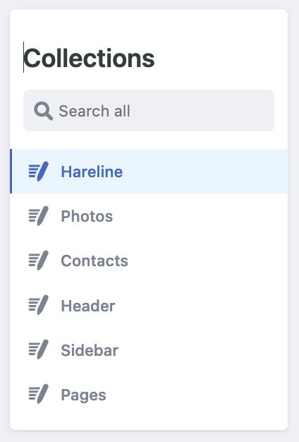
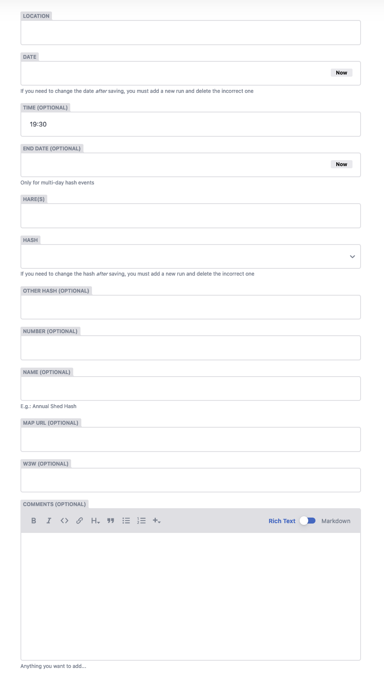

# Dublin Hash House Harriers Website

Built with [Jekyll](https://jekyllrb.com/), using the [Minimal Mistakes](https://mmistakes.github.io/minimal-mistakes/) Jekyll theme.

Admin interface supplied by [netlifycms](https://www.netlifycms.org/docs/intro/)

  

The MIT license means you can do whatever you like with this code, please go ahead and copy and use it however you like.

# Admin User Guide

## How to get administrator privileges

You must have administrator privileges to be able to edit any content on the site (e.g. runs, photos, contacts, etc).  This site is hosted on Github Pages and uses Github accounts for authentication. 

1. Create an account at [Github Signup](https://github.com/signup)

   The account is free, you just need an email address.  You will be prompoted to pick a username, pick anything you like.
   
2. Email any of the current website admins and ask them to add you as a new owner to the website repostiory ("repo")

## How to log in

You can access the admin interfaces at [Admin Interface](https://dublinhhh.github.io/website/admin).  You can always find this link on the [About this site](https://dublinhhh.github.io/website/site) page on the website.

Follow that link and you will be prompted to log in with your Github account.

Once you are logged in you will see a list of items that you can update on in the left sidebar: 

## Updating Runs

The hareline is actually an archive of all the runs recorded.  The website is smart enough to display the hareline as just the set of runs that are in the future.  It does this by regenerating the website once a day and including runs whose date is the same or later than the current date.

Pro tip: you will probably want to sort the runs in newest to oldest order, just click the "Sort by" link and select "Date", click it again to reverse the sort order.

### How to add a run

Go to the "Hareline" collection by clicking on it in the sidebar.  From there you can click "New Run".  As a shortcut you can instead use the "Quick Add" button in the header to do the same thing.

The 2 most critical fields are the date and the hash.  The site uses the combination of those two to uniquely identify a run.  

To add a run for a hash other than Dublin H3 or I ♥ Monday, you should select "Other" and fill in the other hash.

You must also supply a location and hares (these can be just "TBA" and updated later if need be).

The "Map URL" will be a clickable link if supplied.  You can provide a link to Google Maps, Open Street Maps or whatever your preferred mapping site is.  Simply find the location on their site and copy/paste the entire  URL from your browser address bar.

Similarly, "W3W" will be clickable link if filled in.  Just enter the 3 words here and the site will turn it into a link.

The majority of the fields are free-form -- you can enter whatever info does (or does not) make sense.

The comments are shown inline with run listings; if they're too long the formatting will be messed up.

When you're ready, click the "Publish" button at the top of the page and then "Publish Now".  This will record the run and update the website (be patient -- it can take a minute or two for the run to appear on the site)

### How to edit or delete a run

Note that if you need to change the hash or the date _after_ you've saved the run it is necessary to delete the run with incorrect info and create a new one.

To change any other fields, just click on the run in the list and edit it appropriately and use "Publish" -> "Publish Now".

To delete a run, select it and then click on the "Delete Entry" button.

## Updating Photos

### How to add a photo

### How to edit or delete a photo

## Updating Links and Contacts

### How to edit the mis-management board

### How to edit the sidebar links

### How to edit the header links

# Technical Implementation Details

## How authentication works

## How set up a copy of this site

## Useful Examples
* https://github.com/NickStees/jekyll-cms
  * https://jekyll-netlifycms.netlify.app/
* https://github.com/daviddarnes/alembic-netlifycms-kit
